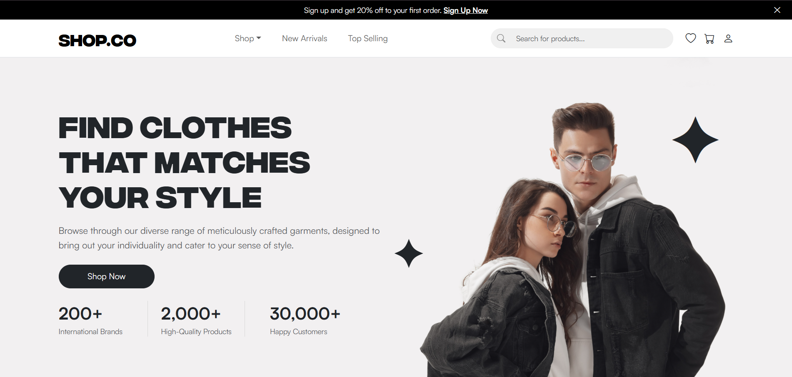
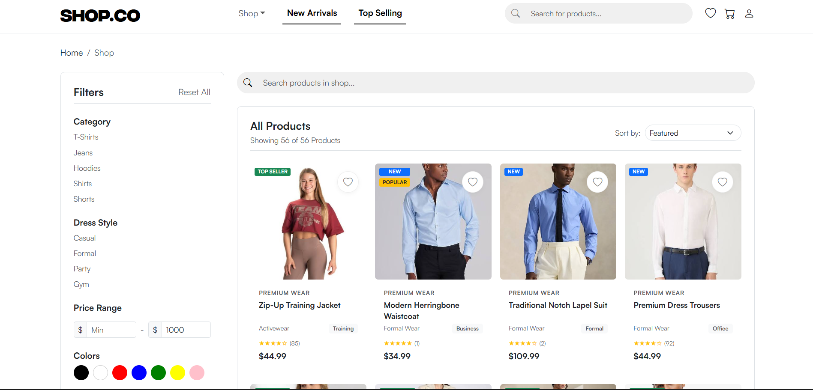
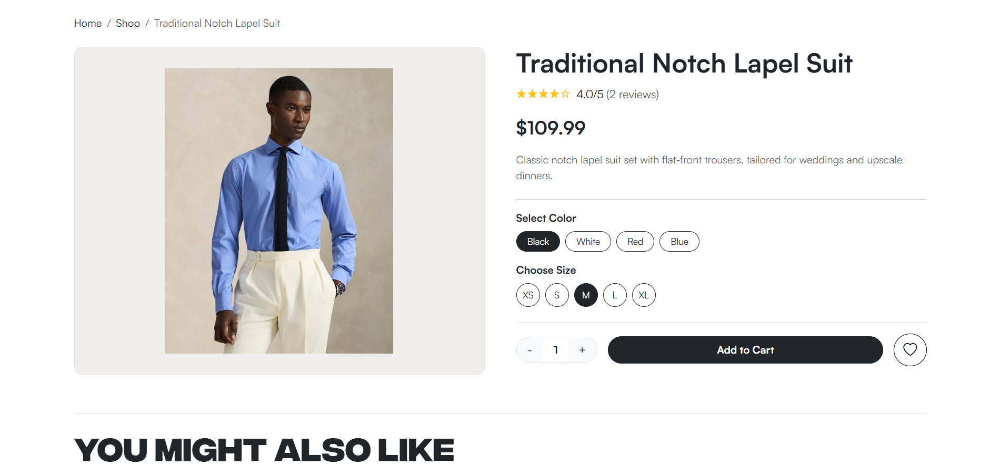
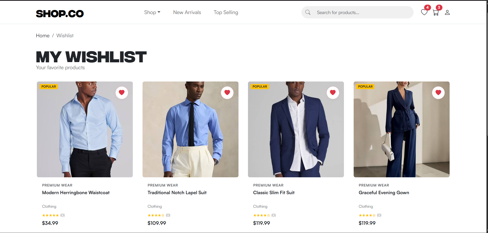
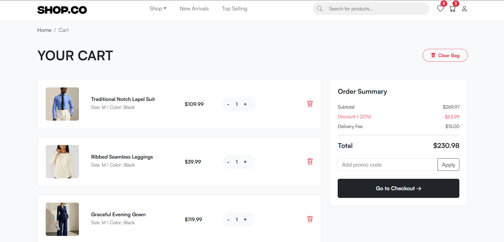
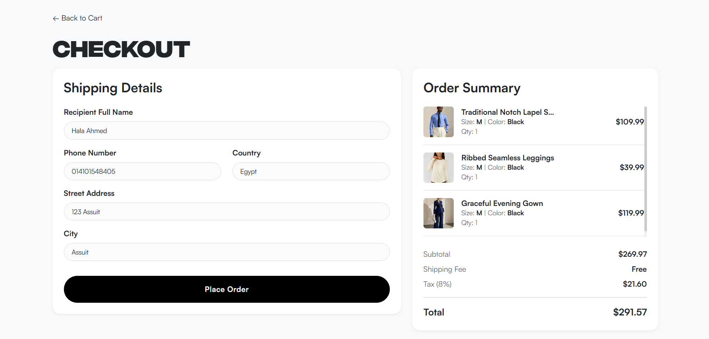
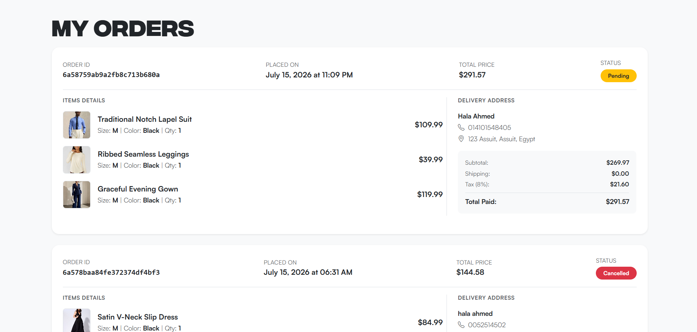
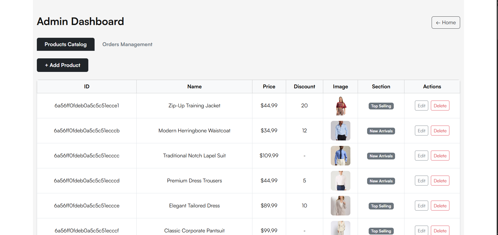
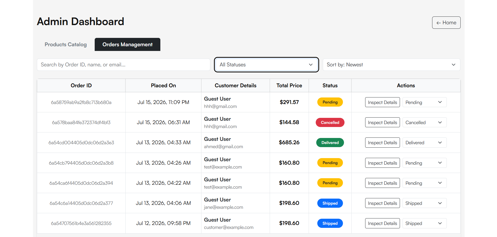
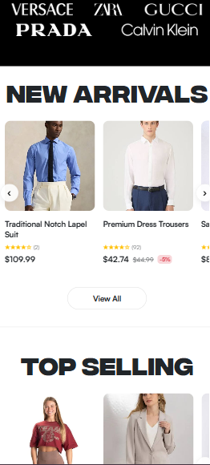

# 🛍️ Shop.CO

### Modern Full-Stack Fashion E-Commerce Platform

A modern, scalable, and fully responsive fashion e-commerce platform built with **React**, **Node.js**, **Express**, and **MongoDB**.

Designed with a premium shopping experience in mind, Shop.CO provides customers with a fast and intuitive interface while offering administrators a powerful dashboard for managing products and customer orders.

---


</div>

---

# 📖 Overview

**Shop.CO** is a production-ready full-stack fashion e-commerce application that demonstrates modern web development practices using the MERN ecosystem.

The application delivers a complete online shopping experience including authentication, advanced product filtering, shopping cart management, wishlist functionality, product reviews, secure checkout, customer order history, and a role-based administrative dashboard.

The project was built with a strong focus on:

- Responsive Design
- Clean UI/UX
- Component Reusability
- Secure Authentication
- Performance Optimization
- Scalable Architecture

---

# ✨ Features

## 👤 Customer Features

- Secure User Registration & Login
- JWT Authentication
- Browse Fashion Products
- Advanced Shop Filters
- Search Products
- Filter by Category
- Filter by Brand
- Filter by Dress Style
- Filter by Price
- Filter by Rating
- Filter by Color
- Filter by Size
- Product Details Page
- Related Products Recommendation
- Add to Cart
- Wishlist Management
- Quantity Management
- Size & Color Selection
- Product Reviews & Ratings
- Customer Order History
- Responsive Mobile Experience

---

## 👨‍💼 Admin Features

- Secure Admin Dashboard
- Product Management
- Order Management
- Update Order Status
- View Customer Orders
- Protected Admin Routes
- Role-Based Authorization
- Dashboard Statistics

---

# 🛠 Tech Stack

## Frontend

- React 18
- React Router DOM
- Axios
- React Context API
- TanStack Query (React Query)
- Bootstrap 5
- Bootstrap Icons
- React Toastify
- Vite

---

## Backend

- Node.js
- Express.js
- MongoDB
- Mongoose
- JWT Authentication
- bcryptjs
- dotenv

---

## Architecture

```
React
      │
Axios API Layer
      │
Express REST API
      │
Authentication Middleware
      │
Controllers
      │
MongoDB (Mongoose)
```

---

# 🚀 Main Highlights

✅ JWT Authentication

✅ Role-Based Authorization

✅ Advanced Product Filtering

✅ Wishlist System

✅ Shopping Cart

✅ Customer Reviews

✅ Related Products Recommendation

✅ Order Management

✅ Admin Dashboard

✅ Responsive Design (320px → 1440px)

✅ Premium UI/UX

✅ Mobile Optimized

---

# 📱 Responsive Design

The application has been fully optimized for multiple screen sizes.

| Device | Supported |
|---------|-----------|
| 📱 Mobile | ✅ |
| 📱 Large Mobile | ✅ |
| 📱 Tablet | ✅ |
| 💻 Laptop | ✅ |
| 🖥 Desktop | ✅ |

Supported breakpoints:

- 320px
- 375px
- 425px
- 576px
- 768px
- 992px
- 1200px
- 1440px

---

# 📂 Project Structure

```
## Frontend

```text
src/
│
├── api/                  # Axios configuration
├── assets/               # Images, fonts and icons
├── components/
│   ├── common/
│   ├── home/
│   ├── layout/
│   ├── product/
│   ├── shop/
│   ├── wishlist/
│   ├── cart/
│   └── admin/
│
├── contexts/
│   ├── AuthContext
│   ├── CartContext
│   ├── WishlistContext
│   └── FilterContext
│
├── hooks/
├── pages/
├── services/
├── data/
├── utils/
├── App.jsx
└── main.jsx
```

---

## Backend

```text
server/
│
├── config/
├── controllers/
├── middleware/
├── models/
├── routes/
├── data/
├── scripts/
├── app.js
├── server.js
└── package.json
```

---

# ⚙️ Installation

## Clone Repository

```bash
git clone https://github.com/ShahdAhmed2/shopco-ecommerce.git
```

```bash
cd shopco-ecommerce
```

---

## Install Frontend

```bash
npm install
```

---

## Install Backend

```bash
cd server
npm install
```

---

# 🔑 Environment Variables

## Backend (.env)

Create a `.env` file inside the **server** folder.

```env
PORT=5000

MONGO_URI=your_mongodb_connection

JWT_SECRET=your_secret_key
```

---

## Frontend (.env)

```env
VITE_API_URL=http://localhost:5000/api
```

---

# 🌱 Seed Database

To populate the database with products and demo data:

```bash
cd server

npm run seed
```

The project currently includes:

- Fashion Products
- Reviews
- Admin Account
- Demo Users
- Orders
- Categories
- Brands

---

# ▶️ Run Project

## Start Backend

```bash
cd server

npm run dev
```

Backend runs on

```
http://localhost:5000
```

---

## Start Frontend

```bash
npm run dev
```

Frontend runs on

```
http://localhost:5173
```

---

# 🔐 Authentication

Shop.CO uses **JWT Authentication**.

Authentication Flow

```
Register
      │
Login
      │
Generate JWT
      │
Store Token
      │
Protected Requests
      │
Verify Token Middleware
```

---

# 👥 Authorization

Two user roles are supported.

| Role | Permissions |
|------|-------------|
| User | Shopping, Reviews, Orders, Wishlist |
| Admin | Full Dashboard Access |

Only administrators can:

- Manage Products
- Manage Orders
- Update Order Status
- Access Dashboard
- View All Orders

---

# 🗄 Database Models

The application uses MongoDB with Mongoose.

Main Collections

- Users
- Products
- Orders
- Reviews

Relationships include:

- User → Orders
- User → Reviews
- Order → Products
- Product → Reviews

---

# 📦 Product Catalog

The store includes a premium fashion catalog covering multiple categories.

### Categories

- T-Shirts
- Shirts
- Jeans
- Hoodies
- Formal Wear
- Party Wear
- Activewear

---

### Brands

- UrbanX
- StreetCore
- NovaWear
- PrimeWear
- Aura
- MotionFit
- EliteWear

---

### Sections

- New Arrivals
- Top Selling

---

### Dress Styles

- Casual
- Formal
- Party
- Gym
- Streetwear
- Business
- Office
- Activewear
- Training

# 🛒 Customer Features

Shop.CO delivers a complete shopping experience with powerful features designed for customers.

### 👤 Authentication

- Secure Registration
- Secure Login
- JWT Authentication
- Persistent Login
- Protected Routes

---

### 🛍 Shopping Experience

- Browse Products
- Search Products
- Product Details
- Related Products
- Similar Product Recommendations
- New Arrivals Section
- Top Selling Section
- Browse by Dress Style

---

### 🎯 Advanced Filtering

Customers can filter products by:

- Category
- Brand
- Dress Style
- Color
- Size
- Rating
- Price Range
- New Arrivals
- Top Selling

Filters synchronize with URL query parameters, allowing users to share filtered product links.

---

### ❤️ Wishlist

- Add Products
- Remove Products
- Persistent Wishlist
- Mobile Optimized Layout

---

### 🛒 Shopping Cart

- Add to Cart
- Remove Items
- Quantity Controls
- Size Selection
- Color Selection
- Order Summary
- Price Calculation

---

### ⭐ Reviews

Authenticated customers can:

- Write Reviews
- Rate Products
- Delete Their Reviews
- View Customer Ratings

---

### 📦 Orders

Customers can:

- Checkout
- View Order History
- Track Order Status
- View Purchased Products

---

# 👨‍💻 Admin Dashboard

A complete administration dashboard is included.

### Product Management

- View Products
- Create Products
- Edit Products
- Delete Products

---

### Orders Management

Administrators can:

- View All Orders
- Inspect Order Details
- View Shipping Information
- View Purchased Products
- Update Order Status

Supported Statuses:

- Pending
- Confirmed
- Shipped
- Delivered

---

### Dashboard Security

- Admin Only Access
- JWT Protected APIs
- Role-Based Authorization

---

# 📡 REST API Overview

## Authentication

| Method | Endpoint |
|---------|----------|
| POST | /api/auth/register |
| POST | /api/auth/login |
| GET | /api/auth/profile |

---

## Products

| Method | Endpoint |
|---------|----------|
| GET | /api/products |
| GET | /api/products/:id |
| POST | /api/products |
| PUT | /api/products/:id |
| DELETE | /api/products/:id |

---

## Reviews

| Method | Endpoint |
|---------|----------|
| GET | /api/reviews/product/:id |
| POST | /api/reviews |
| DELETE | /api/reviews/:id |

---

## Orders

| Method | Endpoint |
|---------|----------|
| POST | /api/orders |
| GET | /api/orders/my-orders |
| GET | /api/orders |
| PUT | /api/orders/:id/status |

---

# ⚛ React Context API

The application uses Context API to manage global state.

Contexts include:

- AuthContext
- CartContext
- WishlistContext
- FilterContext

---

# 🪝 Custom Hooks

Reusable hooks simplify data fetching and state management.

Examples include:

- useProducts
- useWishlist
- useCart
- useReviews

---

# 🧩 Reusable Components

The application is built using modular reusable components.

Examples:

- Header
- Footer
- Hero Section
- Product Card
- Home Product Card
- Product Modal
- Product Section
- Related Products Slider
- Sort Dropdown
- Pagination
- Filter Sidebar
- Customer Reviews
- Browse By Dress Style
- Newsletter
- Search Bar

---

# 🚀 Performance Optimizations

Several optimizations were implemented to improve user experience.

### Data Fetching

- React Query
- Axios API Layer
- Cached Requests

---

### Loading States

- Skeleton Loaders
- Lazy Data Rendering
- Optimized API Calls

---

### UI Optimizations

- Smart Pagination
- Active Filter Chips
- Responsive Sliders
- CSS Animations
- Smooth Hover Effects
- Scroll Snap Sliders

---

### Product Recommendations

The "You Might Also Like" section uses a custom similarity algorithm.

Products are ranked based on:

- Same Category
- Same Dress Style
- Same Brand
- Similar Price
- Same Section

The highest scoring products are displayed as recommendations.

---

# 🎨 UI / UX Highlights

Modern shopping experience including:

- Premium Product Cards
- Dedicated Home Cards
- Responsive Navigation
- Mobile Filter Drawer
- Product Image Hover Effects
- Elegant Animations
- Interactive Sliders
- Scroll Snap Sections
- Active Filter Chips
- Empty States
- Smart Pagination
- Discount Badges
- Rating Stars
- Stock Badges
- Smooth Page Transitions
- Fully Responsive Layout

---

# 📈 Project Statistics

Current project includes:

| Item | Count |
|------|------:|
| Product Categories | 7 |
| Seeded Products | 56 |
| User Roles | 2 |
| Database Models | 4 |
| Main Contexts | 4 |
| Responsive Breakpoints | 8 |


# 📸 Application Screenshots

> Replace the placeholder images below with screenshots from your project.

## 🏠 Home Page



---

## 🛍 Shop Page



---

## 📦 Product Details



---

## ❤️ Wishlist



---

## 🛒 Shopping Cart



---

## 💳 Checkout



---

## 📑 Order History



---

## 👨‍💼 Admin Dashboard




---

## 📱 Mobile Responsive



---

# 🌍 Deployment

The project can be deployed using:

### Frontend

- Vercel
- Netlify

### Backend

- Render
- Railway

### Database

- MongoDB Atlas

---

# 🔮 Future Improvements

Some planned enhancements include:

- 💳 Stripe Payment Integration
- 💳 PayPal Checkout
- 📧 Email Notifications
- 📦 Real-Time Order Tracking
- 🎟 Coupon & Discount System
- ❤️ Product Likes Analytics
- 🔔 Push Notifications
- 🌙 Dark Mode
- 🌐 Multi-language Support
- 💬 Live Chat Support
- 🤖 AI Product Recommendations
- 📊 Admin Analytics Dashboard
- 📈 Sales Reports
- 📦 Inventory Alerts
- 🎁 Gift Cards

---

# 🧪 Testing

The application has been manually tested across multiple browsers and devices.

### Desktop Browsers

- Google Chrome
- Microsoft Edge
- Firefox

### Mobile Devices

- Android
- Responsive Chrome DevTools

Supported Screen Sizes

- 320px
- 375px
- 425px
- 576px
- 768px
- 992px
- 1200px
- 1440px

---

# 🤝 Contributing

Contributions are welcome.

If you would like to improve this project:

1. Fork the repository
2. Create a new branch

```bash
git checkout -b feature/new-feature
```

3. Commit your changes

```bash
git commit -m "Add new feature"
```

4. Push the branch

```bash
git push origin feature/new-feature
```

5. Open a Pull Request

---

# 👩‍💻 Author

**Shahd Ahmed**

Front-End & Full-Stack Web Developer

- GitHub: https://github.com/ShahdAhmed2
- LinkedIn: https://www.linkedin.com/in/shahd-ahmed-959991268

> Replace the links above with your actual GitHub and LinkedIn profiles.

---

# 📄 License

This project is licensed under the **MIT License**.

Feel free to use this project for learning and educational purposes.

---

# ⭐ Support

If you found this project useful, consider giving it a ⭐ on GitHub.

It helps support the project and encourages future improvements.

---


## 🛍️ Shop.CO

**Modern Full-Stack Fashion E-Commerce Platform**

Built with ❤️ using React, Node.js, Express & MongoDB.

Thank you for visiting this repository!

⭐ Happy Coding ⭐

